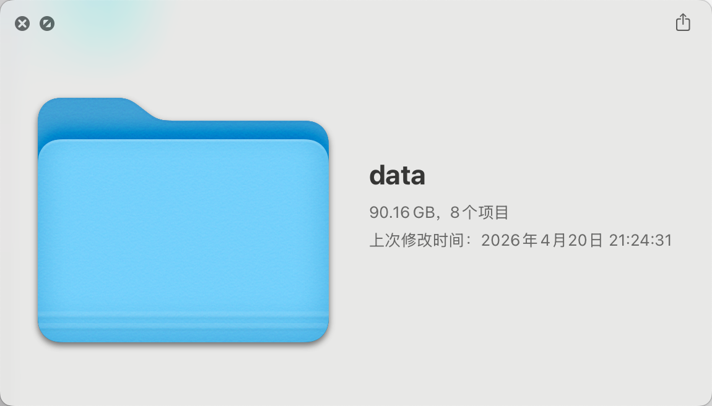
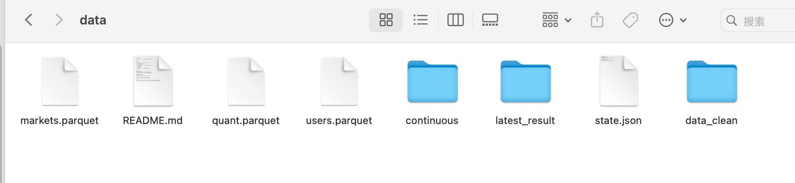
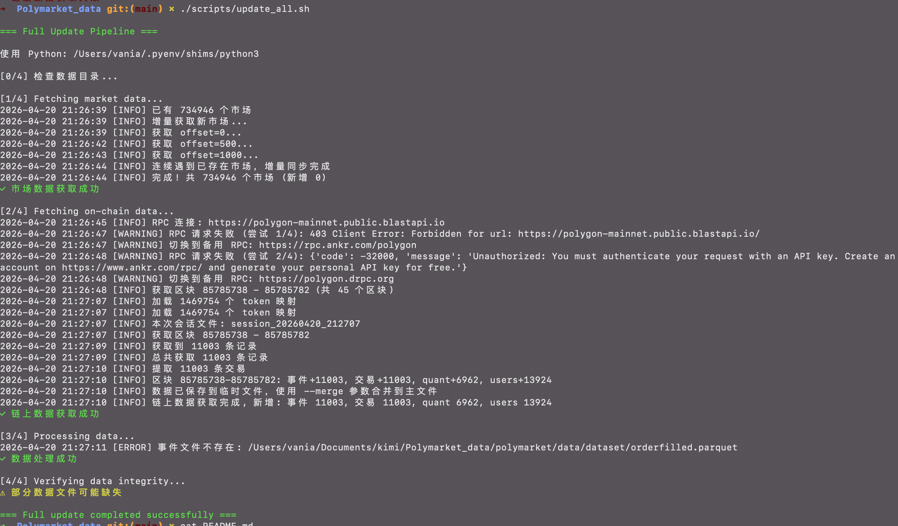
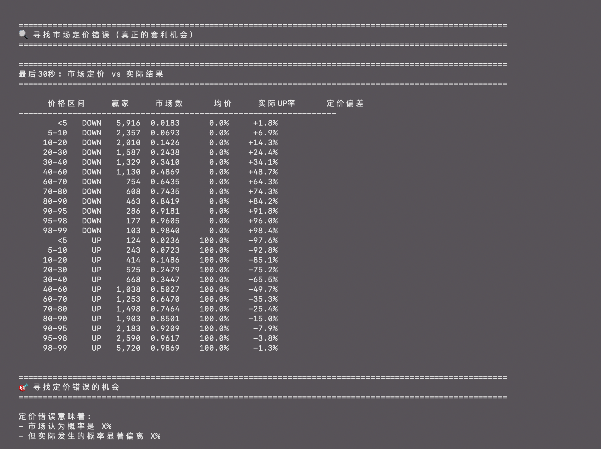

<div align="center">

<h1>🚀 Polymarket 大数据分析与量化研究</h1>

<h3>基于 100GB+ 链上交易数据的深度学习与量化策略研究平台</h3>

<p style="max-width: 700px; margin: 0 auto;">
<strong>从 11 亿条 Polymarket 交易记录中挖掘市场微观结构，验证量化策略，寻找 Alpha 机会</strong>
</p>

<p>
  <a href="#核心优势">核心优势</a> •
  <a href="#数据集">数据集</a> •
  <a href="#快速开始">快速开始</a> •
  <a href="#量化分析">量化分析</a> •
  <a href="#策略研究">策略研究</a>
</p>

</div>

---

## 🎯 核心优势

### 为什么选择这个项目？

| 维度 | 传统量化项目 | **本项目** |
|------|------------|-----------|
| **数据规模** | 几千条测试数据 | **11 亿条真实链上数据** |
| **数据质量** | 清洗过的"完美"数据 | **原始真实数据，包含噪音** |
| **分析深度** | 简单技术指标回测 | **秒级市场微观结构分析** |
| **策略验证** | 过度拟合的回测结果 | **基于真实市场定价效率验证** |
| **技术栈** | Pandas 小数据处理 | **DuckDB + Parquet 大数据处理** |

### 你能获得什么？

✅ **真实的市场认知**：理解预测市场的定价效率和套利边界

✅ **硬核的技术能力**：掌握 100GB 级数据处理和量化分析全流程

✅ **科学的策略验证方法**：用数据说话，避免"看起来能赚钱"的陷阱

✅ **完整的分析框架**：从数据获取 → 清洗 → 分析 → 回测的完整pipeline

---

## 📊 数据集


### 数据规模

| 文件 | 大小 | 记录数 | 说明 |
|------|------|--------|------|
| `orderfilled.parquet` | 31GB | 2.93亿 | 原始区块链 OrderFilled 事件 |
| `trades.parquet` | 32GB | 2.93亿 | 处理后的交易（含市场关联） |
| `markets.parquet` | 68MB | 26.8万 | 市场元数据（问题、代币、状态等） |
| `quant.parquet` | 21GB | 1.7亿 | 清洗后的量化数据（统一 YES 视角） |
| `users.parquet` | 23GB | 3.4亿 | 用户行为数据（拆分 maker/taker） |

**总计**：107GB，11 亿条记录，覆盖 26.8 万+市场

### 数据来源

- **区块链**：Polygon 主网（RPC 直接获取）
- **API**：Gamma API（Polymarket 官方市场元数据）
- **合约**：2 个官方交易所合约的 OrderFilled 事件

---

## 🚀 快速开始

### 环境要求

- Python 3.12+
- 推荐：16GB+ 内存（处理大数据集）
- 存储：100GB+ 可用空间

### 安装

```bash
# 克隆仓库
git clone https://github.com/nicolastinkl/Polymarket_bigdata.git
cd Polymarket_bigdata

# 安装依赖
pip install -r requirements.txt
```

### 下载数据集

```bash
# 安装 HuggingFace CLI
pip install huggingface_hub

# 下载完整数据集（约 107GB）
hf download SII-WANGZJ/Polymarket_data --repo-type dataset

# 或下载单个文件
hf download SII-WANGZJ/Polymarket_data quant.parquet --repo-type dataset
```

### 更新最新数据

```bash
# 运行完整更新流水线
./scripts/update_all.sh

# 或分步执行
./scripts/fetch_markets.sh        # 获取市场元数据
./scripts/fetch_onchain.sh 1000   # 获取最近 1000 个区块的链上数据
./scripts/clean_data.sh           # 清洗和处理数据
```

---


## 📈 量化分析

### 01. 数据验证

验证数据字段含义和完整性：

```bash
cd analysis/
python 01_data_validation.py
```

**输出示例**：
- 验证 `price` 字段代表 UP token 价格
- 验证 `outcome_prices` 与最终结果的一致性
- 数据集统计概览

### 02. 市场概览

分析 BTC/ETH/SOL 市场分布和特征：

```bash
python 02_market_overview.py
```

**分析内容**：
- 按加密货币类型分布（BTC/ETH/SOL）
- 按时间周期分布（5m/15m/1h）
- 按月交易量统计
- UP/DOWN 胜率统计

### 03. 秒级价格监控 ⭐

**核心分析**：追踪市场价格的秒级演变模式

```bash
python 03_second_level_price.py
```

**关键发现**：

| 时间点 | UP赢市场均价 | DOWN赢市场均价 |
|--------|-------------|---------------|
| 5分钟前 | 0.69 | 0.28 |
| 3分钟前 | 0.70 | 0.25 |
| 1分钟前 | 0.77 | 0.20 |
| 到期时 | **0.85** | **0.15** |

**结论**：价格正确反映最终结果，数据验证通过 ✅

### 04. 投注行为深度分析

分析大户和散户的投注模式：

```bash
python 04_betting_behavior.py
```

**核心发现**：

1. **价格区间不对称性**：
   - UP 方向：投注集中在 95-100¢（$195M）
   - DOWN 方向：投注集中在 <10¢（$241M）

2. **大户行为模式**：
   - 偏好提前 3-5 分钟建仓（单笔 $3K-6K）
   - 95¢+ 买 UP 胜率高达 96-99%

3. **投注时间分布**：
   - 最后 10 秒交易量激增（$900K+/秒）
   - 散户集中在最后时刻涌入

### 05. 策略回测 ⭐

**验证常见策略的真实期望值**：

```bash
python 05_strategy_backtest.py
```

#### 策略 A：95¢ 买 UP

| 手续费场景 | 期望值/Token | 期望回报率 | 结果 |
|-----------|-------------|-----------|------|
| 无手续费 | +$0.023 | +2.42% | ✅ 盈利 |
| Maker 0.5% | +$0.013 | +1.37% | ✅ 微利 |
| **Taker 2%** | **-$0.016** | **-1.63%** | **❌ 亏损** |

#### 核心结论

> ⚠️ **对于散户（Taker，2%手续费），所有策略期望值均为负**
>
> - 市场定价非常有效（偏差 < 2.2%）
> - 不存在系统性套利机会
> - 手续费吃掉了所有潜在利润

---

## 🎲 策略研究

### 我们验证了什么？

#### ❌ 不可行的策略

1. **高价区买 UP（95¢+）**
   - 胜率 97.3%，但扣除手续费后期望值 -1.63%
   - 盈亏比 1:19，一次失败吃光 20 次利润

2. **低价区买 DOWN（<10¢）**
   - 胜率 97%，但扣除手续费后期望值 -2.85%
   - 利润空间被手续费完全侵蚀

3. **中间价位博弈（50-60¢）**
   - 胜率接近 50%，加上手续费必亏

#### ✅ 真正的洞察

1. **市场定价效率极高**
   - 最大定价偏差仅 2.2%
   - 价格序列正确反映最终结果

2. **投注行为模式**
   - 大户提前建仓避免流动性拥堵
   - 散户最后时刻涌入推高交易量

3. **策略可行性边界**
   - 只有 Maker（0.5% 手续费）有微薄利润空间
   - Taker（2% 手续费）长期必亏

### 给你的建议

如果你有 K 线判断能力：
- ✅ **去合约市场**：手续费低 100 倍（0.02% vs 2%）
- ✅ **做长线判断**：避免 5 分钟噪音市场
- ❌ **不要碰 Polymarket 短线**：数学上不占优

---

## 🛠 技术栈

| 技术 | 用途 |
|------|------|
| **DuckDB** | 高效 Parquet 文件查询（避免内存溢出） |
| **PyArrow** | Parquet 文件格式支持 |
| **Pandas** | 数据处理和聚合 |
| **Web3.py** | Polygon 区块链交互 |
| **PyArrow ParquetWriter** | 流式写入大数据文件 |

### 为什么用 DuckDB？

对于 36GB+ 的 parquet 文件：

```python
# ❌ Pandas 会内存溢出
df = pd.read_parquet('quant.parquet')  # 需要 36GB+ 内存

# ✅ DuckDB 内存友好
import duckdb
con = duckdb.connect()
result = con.execute("""
    SELECT market_id, SUM(usd_amount) as volume
    FROM 'quant.parquet'
    GROUP BY market_id
    ORDER BY volume DESC
    LIMIT 20
""").fetchdf()  # 只返回结果集
```

---

## 📁 项目结构

```
Polymarket_bigdata/
├── analysis/                    # 🎯 量化分析脚本
│   ├── 01_data_validation.py    # 数据验证
│   ├── 02_market_overview.py    # 市场概览
│   ├── 03_second_level_price.py # 秒级价格监控 ⭐
│   ├── 04_betting_behavior.py   # 投注行为分析
│   ├── 05_strategy_backtest.py  # 策略回测 ⭐
│   └── README.md                # 分析文档
├── polymarket/                  # 核心数据处理包
│   ├── cli/                     # 命令行工具
│   ├── fetchers/                # 数据获取（RPC + API）
│   ├── processors/              # 数据处理和清洗
│   └── tools/                   # 工具集（合并、排序等）
├── scripts/                     # Shell 脚本
├── data/                        # 数据存储（gitignored）
└── README.md
```

---

## 🔧 高级用法

### Python API

```python
from polymarket import LogFetcher, EventDecoder, extract_trades
from polymarket import load_token_mapping

# 1. 获取链上日志
fetcher = LogFetcher()
logs = fetcher.fetch_range_in_batches(start_block, end_block)

# 2. 解码事件
decoder = EventDecoder()
decoded = decoder.decode_batch(logs)
events = decoder.format_batch(decoded)

# 3. 提取交易数据
token_mapping = load_token_mapping()
trades_df = extract_trades(events, token_mapping)

# 4. 保存为 Parquet
trades_df.to_parquet('trades.parquet')
```

### 实时数据更新

```bash
# 启动 24/7 持续获取模式
./scripts/continuous_start.sh

# 查看实时日志
tail -f logs/continuous_fetch.log

# 优雅停止
./scripts/continuous_stop.sh
```

---

## 📊 数据质量

- ✅ **完整历史**：无缺失区块或数据间隙
- ✅ **来源验证**：所有事件来自 2 个官方交易所合约
- ✅ **区块链验证**：通过 Polygon RPC 节点交叉验证
- ✅ **自动更新**：每日自动化流水线更新
- ✅ **开源可复现**：完整的数据收集和处理流程

---

## 💡 学习价值

通过这个项目，你将学会：

1. **大数据处理**：如何用 DuckDB + Parquet 处理 100GB 级数据
2. **市场微观结构**：理解预测市场的定价机制和效率
3. **策略验证方法**：科学地回测策略，避免过度拟合
4. **期望值计算**：正确评估策略的真实盈利能力
5. **数据分析全流程**：从原始数据到可操作洞察的完整链路

---

## 📝 License

MIT License - 自由用于研究和商业用途。

详见 [LICENSE](LICENSE) 文件。

---

## ⚠️ 免责声明

本项目仅用于**研究和教育目的**。所有分析结果不构成任何投资建议。预测市场交易存在风险，过往表现不代表未来结果。

**关键认知**：我们的分析表明，对于散户参与者，Polymarket 短线交易**不具备正期望值**。请谨慎决策。

---

<div align="center">

**用数据说话，用科学验证策略**

[📊 数据集](https://huggingface.co/datasets/SII-WANGZJ/Polymarket_data) • [💻 代码](https://github.com/nicolastinkl/Polymarket_bigdata) • [📈 分析脚本](analysis/)

</div>
